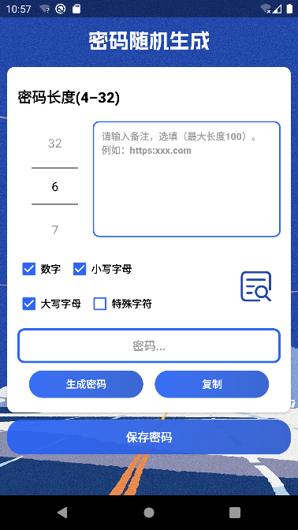
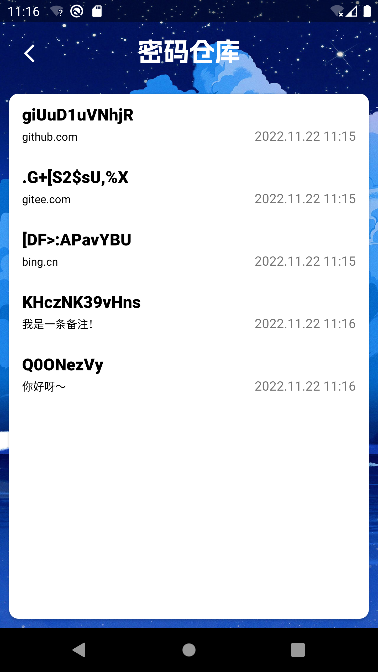
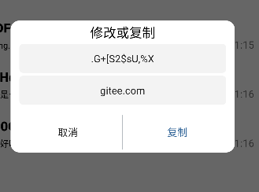

# 密码随机生成与存储 Password Generation🔐

#### 介绍
密码的生成、增加、修改、删除，暂不支持查询

#### 主页面截图

#### 为什么开发该软件
因为本人的“榆木脑袋”🤔，总是记不住密码，在注册账号的时候，也想不出个安全的密码，所以决定做这么一个随机与存储一体的android软件

#### 注意：
1. 该软件设计初意是为了方便个人记录密码，并未考虑周全安全问题，所以关于财产与其他重要信息还请另寻方式存储，若发生信息泄露本人概不负责！
2. 该软件密码信息均存储在本地数据库（数据库暂未进行加密，后续会进行实现），而且不会发送任何网络请求！
3. 密码仓库页面并未对数据查询进行分页处理，若密码存储量过大时，可能会存储显示延时问题。(工作量太大啦，需要后续慢慢完善~😅)
4. 本人目前是在校学生，并没有实战经验，所以代码的简洁与合理、软件的使用体验等等有许多做的不好的地方，还请大家多提意见。
5. 后续会在博客同步更新本软件一些具体的实现细节，博客链接：https://blog.csdn.net/weixin_50957373?spm=1010.2135.3001.5343

#### 开发与运行环境

- 编译版本与目标版本 Android 12
- 最低支持版本 Android 5.0
- JDK1.8
- gradle 7.0.4
- Android Studio 2020.3.1

#### 第三方开源库
passay 1.6.1 

#### 开发者&联系我
“编曲作曲”都是我自己~

17640460984@163.com
